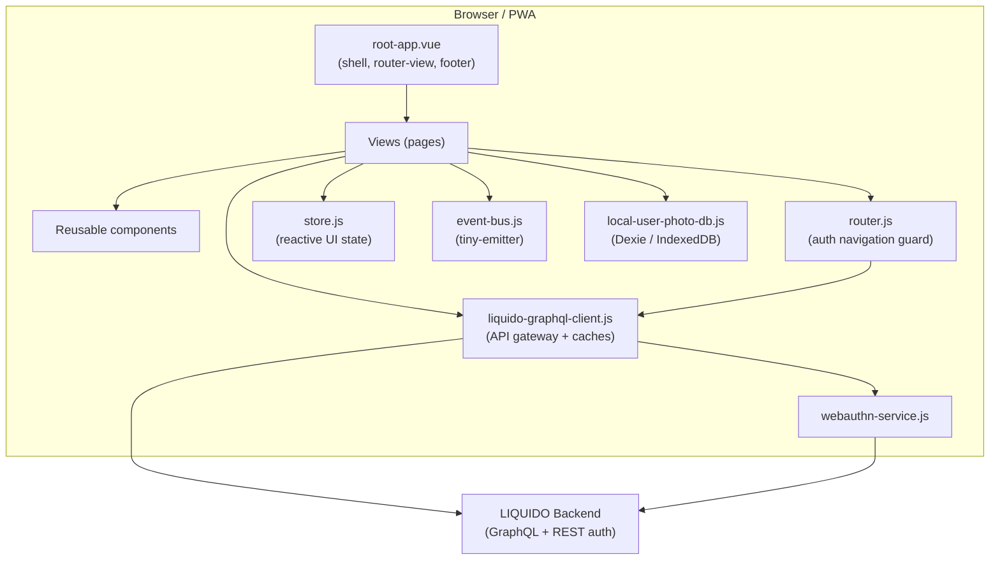
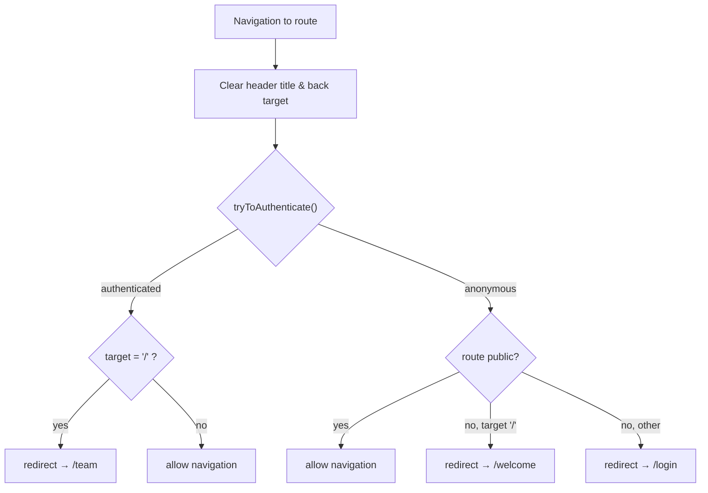
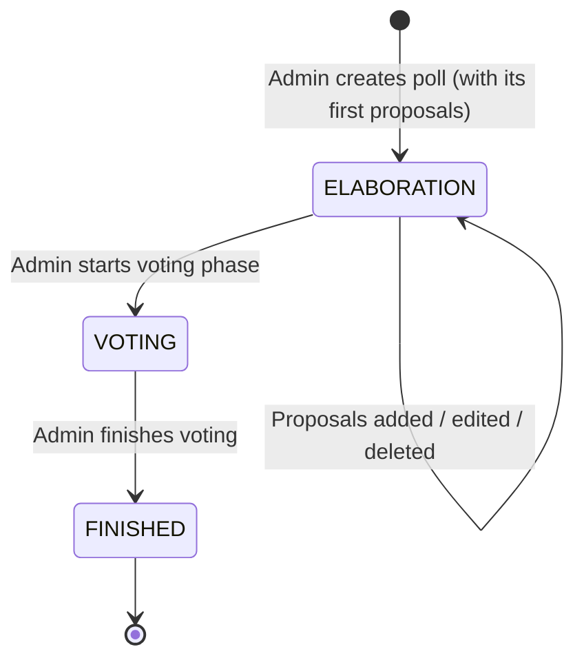

# LIQUIDO Mobile PWA — Technical Architecture

> Technical overview of the LIQUIDO mobile Progressive Web App (Vue 3).
> Audience: developers working on the codebase.

---

## 1. Tech Stack

| Concern | Technology | Version | Notes |
|---|---|---|---|
| UI framework | Vue | `^3.5.21` | **Target: `<script setup>` Composition API.** 6 of 32 SFCs use it today; the remaining Options API pages are legacy and will be migrated (see §12) |
| Build tool / dev server | Vite | `^8.0.10` | HTTPS dev server, env-based config alias |
| Router | vue-router | `^4.2.5` | `createWebHistory`, global auth navigation guard |
| i18n | vue-i18n | `^9.7.1` | Legacy mode with `allowComposition: true` |
| CSS framework | Bootstrap | `^5.3.8` | Imported via npm in `main.js`; overridden by `liquido.css` design tokens |
| Icons | Font Awesome | 6.5.2 (free) | Static files under `public/fontawesome-free-6.5.2-web/` |
| HTTP transport | axios | `^1.16.0` | Used by the GraphQL client |
| Client cache | populating-cache | `^5.7.0` | TTL caches for team and polls |
| WebAuthn | @simplewebauthn/browser | `^13.2.2` | Passkey / 2FA registration and login |
| Local DB | dexie | `^4.4.2` | IndexedDB wrapper (e.g. local user photo store) |
| Event bus | tiny-emitter | `^2.1.0` | Cross-component pub/sub |
| QR codes | qrcode | `^1.5.3` | Team invite links |
| Animation | gsap | `^3.12.2` | |
| Logging | loglevel | `^1.9.2` | Full logging enabled in dev/test |
| Date/time | dayjs | `^1.11.10` | |
| Unit tests | vitest | `^3.2.4` | + `@vue/test-utils`, jsdom |
| E2E tests | cypress | `^15.17.0` | |

---

## 2. High-Level Architecture



The app is a single-page PWA. All backend communication is funnelled through a single
gateway module, `liquido-graphql-client.js`, which owns authentication (JWT), transport,
and in-memory caching.

---

## 3. Application Bootstrap

Entry point: `src/main.js`

1. Imports the environment-specific `config` (see §4).
2. Logs a welcome banner and the active config source + API URL.
3. Enables full `loglevel` logging in `development` and `test` modes.
4. Imports global CSS **in order**: `bootstrap/dist/css/bootstrap.css` **then**
   `@/styles/liquido.css` — the LIQUIDO stylesheet must load *after* Bootstrap so its
   design-token overrides win.
5. Creates the Vue app from `root-app.vue`.
6. Installs plugins: `router`, `vue-i18n` (`createI18n`), and the reactive `store`.
7. Mounts the app.

### i18n configuration
- `createI18n` is set up with `locale: "de"`, `fallbackLocale: "de"`,
  `allowComposition: true`, `silentFallbackWarn: true`, `warnHtmlInMessage: 'off'`.
- Global translations live in `globalTranslations` inside `main.js`.
- **Local component messages** must be added to `globalTranslations` (or an `<i18n>`
  SFC custom block). `useI18n({ useScope: "local" })` alone throws in legacy mode
  because no custom-block plugin is configured.

---

## 4. Configuration System

- Components import a bare specifier: `import config from "config"`.
- `vite.config.js` maps `config` to `config/config.<NODE_ENV>.js` at build time.
- Shared defaults live in `config/config.common.js`.
- Exposes values such as `LIQUIDO_API_URL`, `BASE_URL`, `mockBackend`, `avatarPath`,
  `inviteLinkPrefix`, and `configSource`.
- `config.mockBackend` toggles the mocked GraphQL client and turns the header red as a
  visual warning.

### Validation rules come from the backend

`query liquidoConfig` is fetched once at startup (`root-app.vue` → `loadLiquidoConfig()`, alongside
the ping) and merged over `config.common.js` with `Object.assign`.

**The values in `config.common.js` are FALLBACKS, not the truth** — they only keep the app usable when
the backend is unreachable. The backend owns the rule, because it is the side that enforces it:
`usernameMinLength`, `inviteCodeLength`, `minPasswordLength`, `allowMembersToInvite`,
`pollTitleMinLength`, `pollDefaultRuntimeDays`, `proposalTitleMinLength`,
`proposalDescriptionMinLength` and `inviteLinkPrefix`.

This exists because the two had already drifted: `proposalDescriptionMinLength` read 10 here while
`ProposalEntity` enforces `@Size(min = 20)`, so a 12-character description passed every check the user
could see and was then refused by the server. A backend test now locks that value to the entity
annotation. `inviteLinkPrefix` was worse — it hardcoded the production host and the *old* join flow in
every environment.

`avatarPath` deliberately stays local: it points at files bundled with this PWA, so the backend has no
way to know it.

It is fetched via a **separate query rather than by extending `ping`**, which is documented in the
backend as "Keep this very simple! Just return a string!" and is the liveness check.

---

## 5. Routing & Authentication Guard

Router: `src/services/router.js` using `createWebHistory(config.BASE_URL)`.
`scrollBehavior` is disabled (returns `false`); scroll position is managed in
`root-app.vue` instead to avoid `history.state` warnings.

### Routes

| Path | Name | Public | Component |
|---|---|---|---|
| `/` | index | — | (redirect logic only) |
| `/login` | login | ✅ | login-page.vue |
| `/welcome` | welcome | ✅ | welcome-chat.vue |
| `/joinTeam` | joinTeamV2 | ✅ | join-team-v2.vue |
| `/verifyEmail` | verifyEmail | ✅ | verify-email.vue |
| `/forgotPassword` | forgotPassword | ✅ | forgot-password.vue |
| `/resetPassword` | resetPassword | ✅ | forgot-password.vue |
| `/team` | team | 🔒 | team-home.vue |
| `/userhome` | userhome | 🔒 | user-home.vue |
| `/polls` | polls | 🔒 | polls.vue |
| **`/polls/new`** | **newPoll** | 🔒 | **poll-edit.vue** — the all-in-one poll editor |
| **`/polls/:pollId/edit`** | **editPoll** | 🔒 | **poll-edit.vue** — same editor, existing poll |
| `/polls/:pollId` | showPoll | 🔒 | poll-show.vue |
| `/polls/:pollId/castVote` | castVote | 🔒 | cast-vote.vue |
| `/polls/:pollId/winner` | pollWinner | 🔒 | poll-winner.vue |
| ~~`/polls/create`~~ | createPoll | 🔒 | poll-create.vue — **DEPRECATED** |
| ~~`/polls/:pollId/add`~~ | addProposal | 🔒 | proposal-add.vue — **DEPRECATED** |
| ~~`/polls/:pollId/editProposal/:proposalId`~~ | editProposal | 🔒 | proposal-add.vue — **DEPRECATED** |
| `/polly/create` | createPolly | ✅ | polly-create.vue |
| `/404` | pageNotFound | ✅ | not-found-page.vue |
| `/:pathMatch(.*)*` | — | — | redirect → `/404` |

Dev-only routes (added when `MODE === "development"`): `/devLogin`, `/_design-overview`.

**Route ordering matters.** `/polls/create` and `/polls/new` are declared *before* `/polls/:pollId`,
or the parameterised route swallows them and treats "new" as a poll id.

### ⚠️ Deprecated routes — to be removed in one of the next releases

`/polls/create`, `/polls/:pollId/add` and `/polls/:pollId/editProposal/:proposalId` are the original
**three-page flow**: create a poll, then navigate again to add each proposal, then again to edit one.
They have been superseded by the single-page editor at `/polls/new` and `/polls/:pollId/edit`.

Nothing links to them any more — `polls.vue`'s "create poll" button, `poll-show.vue`'s "add proposal"
button and the pencil on a proposal all point at the editor. They remain **reachable by URL on
purpose**, so the new editor can be exercised with the old flow still available as a fallback.

Until they are deleted: keep them working, and do not delete `poll-create.vue` or `proposal-add.vue`.

### Adding a route

Two things are easy to forget:
1. Add the route name to the `page_order` map in `root-app.vue`, or the page-slide transition picks
   the wrong direction.
2. Add the page to `_design-overview.vue`, the dev-only gallery of every screen.

There are **no role guards in the router**. `meta.public` is the only route-level flag; admin-vs-member
is decided per component via `api.isAdmin()`, and enforced for real by the backend.

### Navigation guard (`router.beforeEach`)



`tryToAuthenticate()`:
1. If `api.isAuthenticated()` (JWT + team + user in cache) → resolve immediately
   (saves a backend call, even if the JWT may be expired).
2. Else read JWT from `localStorage` and call `api.loginWithJwt(jwt)`.
3. On `JWT_TOKEN_EXPIRED` / `JWT_TOKEN_INVALID`, remove the JWT from `localStorage`.

---

## 6. API Layer — `liquido-graphql-client.js`

Central gateway; the **only** module that talks to the backend. A mock twin,
`liquido-graphql-client.mock.js`, is swapped in when `config.mockBackend` is set.

### Responsibilities
- GraphQL transport over axios.
- JWT authentication: attaching the token, storing it in `localStorage`
  (`LIQUIDO_JWT_KEY`) and in the in-memory `teamCache`.
- In-memory caching via `populating-cache`.

### Caches

| Cache | Holds | Notes |
|---|---|---|
| `teamCache` | `team`, `currentUser`, `jwt` | Populated on login (`loginWithJwt` / auth success) |
| `pollsCache` | `polls` array | Seeded with `[]` until polls load after login |

### Key synchronous accessors
- `api.getCachedUser()` → current user object
- `api.getCachedTeam()` → current team object
- `api.getCachedPolls()` → array of polls
- `api.isAdmin()` → boolean, read from the JWT's `groups` claim (see below)
- `api.isAuthenticated()` → JWT + team + user all present

> ⚠️ **None of these is reactive.** They read plain cache objects, so calling one inside a Vue
> `computed` makes that computed latch whatever it saw on its first evaluation and never re-run.
> Use a **method**, not a computed. This caused a real bug: a cold cache once meant "not an admin"
> for the life of the page, and the poll editor rendered without its title field.

### `api.isAdmin()` reads the JWT

`jwt-util.js` decodes the token's payload and looks for `LIQUIDO_ADMIN` in the `groups` claim — the
very same claim `JwtTokenUtils.isAdmin()` authorises on in the backend, so the two agree by
construction. The backend re-mints the token on every login *and* every `switchTeam`, so the claim
always describes the team the user is currently in (admin-ness is **per team**, not per user).

This replaced an older implementation that re-derived the answer by searching the cached team's
`ADMIN` members for the cached user's id — which needed two caches populated and two ids to match
under strict equality, and silently answered "not an admin" whenever any of that did not hold.

**This is not a security boundary.** The browser cannot verify a signature and the token comes out of
its own `localStorage`. It decides what to *show*; the backend enforces what is *allowed*.

### GraphQL operations

| Operation | Purpose |
|---|---|
| `liquidoConfig` | validation rules shared with the backend (see §4) |
| `ping` | liveness check; deliberately returns a plain String |
| `polls`, `poll` | fetch |
| `createPoll`, `updatePoll` | create / rename (rename is admin-only, ELABORATION only) |
| `addProposal`, `updateProposal`, `deleteProposal` | proposals (see §8 for who may do which) |
| `likeProposal` | support a proposal |
| `startVotingPhase`, `castVote`, `finishVotingPhase` | the voting phase |

REST (via `login-rest-client.js`) covers auth and mail: `requestPasswordResetEmail`, `resetPassword`,
`loginWithEmailToken`, `welcomeMail`, `verifyEmail`, `resendEmailVerification`.

### Auth lifecycle
- `loginWithJwt(jwt)` — authenticates, fills `teamCache`, persists JWT.
- `logout()` — clears JWT from `localStorage`, empties `teamCache` and `pollsCache`.

---

## 7. Authentication Methods

- **JWT auto-login** — silent re-auth from `localStorage` on every navigation.
- **Email + password** — `login-page.vue`.
- **Email magic link / token** — `email` + `emailToken` query params on `/login`.
- ~~**SMS**~~ — **not wired up.** There is no `/login-via-sms` route: a mobilephone is optional in
  LIQUIDO and is no longer collected anywhere in the UI, and the backend's `requestSmsToken` /
  `loginWithSmsToken` are commented out, so the page's calls would hit operations that are not in the
  schema. `login-via-sms.vue` is kept in the repo on purpose, as the starting point for when SMS login
  is actually built.
- **WebAuthn / Passkey** — `webauthn-service.js` (`@simplewebauthn/browser`) for
  passwordless login and 2FA registration.
- **Forgot / reset password** — `forgot-password.vue` (shared by `/forgotPassword`
  and `/resetPassword`).
- **Dev login** — `/devLogin` (development mode only) for automated testing.

### Email verification is *not* an authentication method

`/verifyEmail?verifyToken=…` confirms that an address really belongs to its owner. It is **optional**
— it never blocks registering, joining or voting — and it **grants nothing**: no session, no JWT, no
privileges. It flips `UserEntity.emailVerified` and shows a confirmation page from which the user logs
in normally.

That property is what the whole design rests on. Because the link cannot log anybody in, it is safe to
send as a clickable link and it never has to expire; the worst a leaked one can do is mark an address
verified that its owner already receives mail at.

Two things follow, and both matter:

- The parameter is `verifyToken`, deliberately **not** `emailToken`. `emailToken` is the magic-link
  LOGIN token which `login-page.vue` auto-consumes together with `email`. Confusing the two would turn
  the welcome mail into a way to log in. `WelcomeMailService` in the backend documents this rule.
- The `/verifyEmail` page offers **no resend button**. An invalid token identifies nobody, so a resend
  would need an anonymous "mail this address" endpoint — a way to make LIQUIDO send mail to strangers
  on request. It links to the login instead.

Resending happens from the **reminder on the team page**, shown while `emailVerified` is false, where
the caller is authenticated and the backend derives the recipient from the JWT. Issuing a new link
invalidates the previous one.

---

## 8. Poll Lifecycle



There are exactly **three** statuses. (An earlier version of this document listed a separate `NEW`
state; no such status exists — `PollEntity.status` defaults to `ELABORATION`.)

| Status | German label | Meaning |
|---|---|---|
| `ELABORATION` | "Neu" / "wird bald gestartet" | Proposals are being collected and debated |
| `VOTING` | "Wahl läuft" | Ballots are being cast |
| `FINISHED` | "Abgeschlossen" | Result available |

### Who may change what, while in ELABORATION

Enforced by the backend (`PollService`); the frontend only decides what to render.

| Action | Admin | Member |
|---|---|---|
| Rename the poll (`updatePoll`) | ✅ | ❌ |
| Add a proposal (`addProposal`) | ✅ always | only if `poll.membersCanAddProposals` |
| Edit a proposal (`updateProposal`) | **own only** | **own only** |
| Delete a proposal (`deleteProposal`) | ✅ any | ❌ |

The asymmetry in the last two rows is deliberate: an admin may take a proposal **off** the ballot but
may not **rewrite** somebody else's words — a removal is visible to its author, a silent edit is not.
`PollService.updateProposalInPoll` therefore has no admin override, by design.

`membersCanAddProposals` is chosen at creation time and cannot be changed afterwards; there is no
mutation for it. Once the poll is in `VOTING`, everything is frozen.

### The poll editor (`poll-edit.vue` + `poll-card-edit.vue`)

One page serves both creating and editing, chosen by the presence of a `pollId` route param — the same
trick `proposal-add.vue` used for add-vs-edit.

- **Create mode** (`/polls/new`) holds everything locally and submits once: `createPoll`, then one
  `addProposal` per row, **sequentially** (the backend rejects duplicate titles within a poll, and
  each call rewrites the cached poll). It starts with two empty rows, because a poll needs two
  alternatives to be a choice at all.
  On a **partial failure** the poll already exists, so the page keeps `createdPollId`, marks the rows
  that saved, and turns its button into "Weiter", which retries only what is left.
- **Edit mode** (`/polls/:pollId/edit`) has no draft: each change is its own mutation — title on blur,
  proposals per row.
- A `beforeRouteEnter` guard loads the poll and **redirects to `poll-show.vue` unless it is in
  `ELABORATION`**. This has to happen before mount: redirecting from inside `created()` leaves the
  view on screen over a half-finished page transition, showing an empty page.

`poll-card-edit.vue` is a separate component from `poll-card.vue` rather than a mode of it, because
`poll-card.vue` pins `--poll-card-height` / `--proposal-height` to `10rem` (its list transitions go
jumpy without a fixed height) and an editor with input fields cannot live inside that.

### Voting flow
1. Member opens a poll in `VOTING` state (`poll-show.vue`).
2. Navigates to `cast-vote.vue` (`/polls/:pollId/castVote`).
3. Orders proposals into a preference ballot and submits.
4. Verifies the returned ballot checksum — the anonymity guarantee made checkable.
5. Admin later finishes the voting phase; the Ranked Pairs winner becomes visible
   (`poll-winner.vue`).

---

## 9. Cross-Cutting Concerns

### State — `store.js`
Lightweight reactive store for UI state (e.g. `headerTitle`, `headerBackTarget`).
Cleared by the router guard on every route change so each page can set its own.

### Event bus — `event-bus.js`
`tiny-emitter` pub/sub. Known events: `LOGIN`, `LOGOUT`, `POLLS_LOADED`, `POLL_LOADED`,
`MOBILE_DEBUG_LOG`, `CLICK_HEADER_CENTER`.

### Design system — `styles/liquido.css`
CSS custom properties drive the whole visual language: `--primary`, `--secondary`,
`--text-color`, `--app-background`, `--liquido-info-*`, `--state-*`, spacing units
(`--unit`, `--two`, …). Bootstrap components are re-skinned by aliasing `--bs-*`
variables (e.g. `.btn-primary` uses `--bs-btn-bg: var(--primary)`).

### Mobile debug log
`mobile-debug-service.js` + `mobile-debug-log.vue` provide an on-device log overlay
(useful on phones without dev tools), fed via the `MOBILE_DEBUG_LOG` event.

---

## 10. Project Structure

```
src/
  main.js                     App bootstrap, i18n, global CSS
  root-app.vue                Shell: router-view + footer, scroll handling
  components/                 Reusable UI (header, footer, input, poll-card, modals…)
    poll-card.vue             Read-only poll card. Fixed 10rem heights - see §8.
    poll-card-edit.vue        Editable twin of it, free height, used by poll-edit.vue
  services/
    liquido-graphql-client.js API gateway + caches (+ .mock.js twin)
    jwt-util.js               Decode our own JWT (groups claim → isAdmin). Shared by the
                              client AND its mock, which is why it is its own module:
                              the mock is imported BY the client, so importing back
                              would be circular.
    router.js                 Routes + auth navigation guard
    store.js                  Reactive UI state
    event-bus.js              tiny-emitter pub/sub
    webauthn-service.js       Passkey / 2FA
    local-user-photo-db.js    Dexie / IndexedDB
    login-rest-client.js      REST auth + mail calls
    LiquidoExceptionCodes.js  GENERATED from the backend enum - do not hand-edit
  views/                      Pages (one per route)
    poll-edit.vue             The all-in-one poll editor (create + edit)
    verify-email.vue          Email confirmation landing page (public)
    poll-create.vue           DEPRECATED - old create flow
    proposal-add.vue          DEPRECATED - old add/edit proposal flow
  styles/liquido.css          Design tokens + Bootstrap overrides
config/                       Env-specific config (mapped to bare "config" import)
public/                       Static assets (Font Awesome, icons, manifest)
tests/                        unit (vitest) + e2e (cypress)
```

---

## 11. Build & Deploy

- **Dev**: `npm start` (or `npm run dev`) → Vite dev server over HTTPS using the
  mkcert certificates in `tls-certs/`.
- **Build**: `npm run build` → static bundle via Vite.
- **Preview**: `npm run preview`.
- **Container**: `Dockerfile` builds the image; `fly.toml` configures Fly.io deploy;
  `deploy/build-and-deploy.sh` orchestrates the pipeline.

---

## 12. Planned Migrations

### Options API → `<script setup>` Composition API

The app is **migrating to the Composition API with `<script setup>`** — it is the more modern and more
powerful of the two, and mixing both styles makes the codebase harder to reason about. A full
migration will be planned as its own piece of work.

State today: 6 of 32 SFCs already use it (`polls.vue`, `team-home.vue`, `join-team-v2.vue`,
`_design-overview.vue`, `liquido-proposal.vue`, `Polly-vote.vue`). The rest, including the recent
`poll-edit.vue` and `poll-card-edit.vue`, are Options API.

**New components should be written as `<script setup>`.**

**The blocker to finishing it is i18n, not the components.** vue-i18n runs in legacy mode here, so
`$t` is not callable in `<script setup>` and `useI18n()` returns the *global* composer, which cannot
see component-local messages. `Polly-vote.vue` worked around this with a hand-rolled `loc()` helper —
which is exactly the kind of divergence the migration should remove, not spread. A component-local
message catalogue needs either the i18n upgrade planned in `doc/ai/AI-plan migrate to i18n v12.md` or
its strings moved into the global catalogue in `main.js`.

Sequencing that i18n work first would make the component migration mostly mechanical.

---

## 13. Security Notes

- JWTs are stored in `localStorage` and re-validated against the backend on load;
  expired/invalid tokens are proactively purged.
- WebAuthn provides passwordless / phishing-resistant authentication.
- The mocked backend is clearly signalled in the UI (red header) to avoid confusing
  test data with production.
- All backend access is centralised in one module, keeping the auth surface small.
- **Client-side permission checks are cosmetic.** `api.isAdmin()` and every `canEdit…` helper decide
  what to render. The backend re-checks everything; a user who edits their own token only changes
  which buttons they see, and then gets a `LiquidoException` when they press one.
- **The email verification nonce is never exposed.** `UserEntity.emailVerificationNonce` carries both
  `@Ignore` (GraphQL) and `@JsonIgnore`, with a backend test asserting both — it is a public field, and
  one careless refactor would otherwise put it in the schema. `emailVerified` *is* queryable, since the
  frontend needs it for the reminder.
- **REST endpoints no longer leak stack traces.** `LiquidoErrorExtensionProvider` only covers GraphQL,
  so until `LiquidoExceptionMapper` was added every REST endpoint that threw a `LiquidoException`
  answered with a bare HTTP 500 and Quarkus' default error page, including the message and a source
  snippet. It now returns the status the error declares, with the same `liquidoException` envelope the
  GraphQL side produces — so a client reads `liquidoErrorCode` the same way either way, and the UI can
  put it in the DOM as `data-error-code` instead of matching on translated text.
