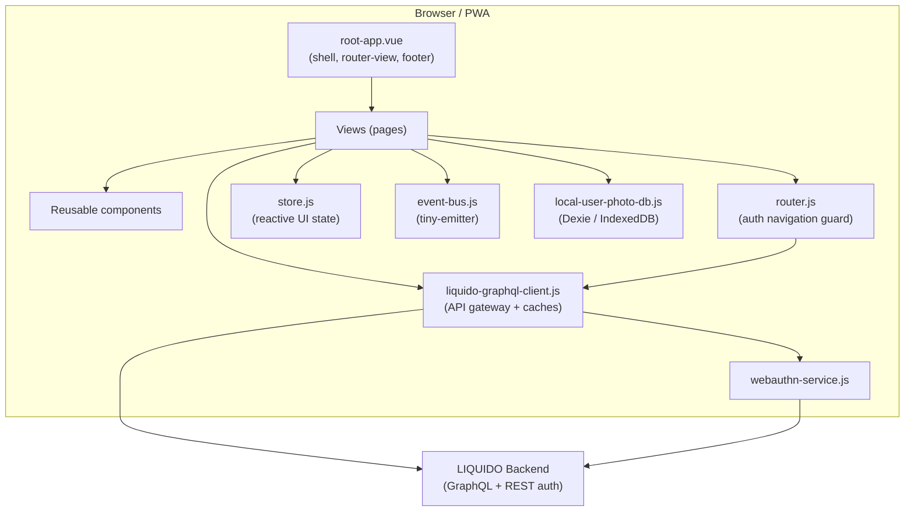
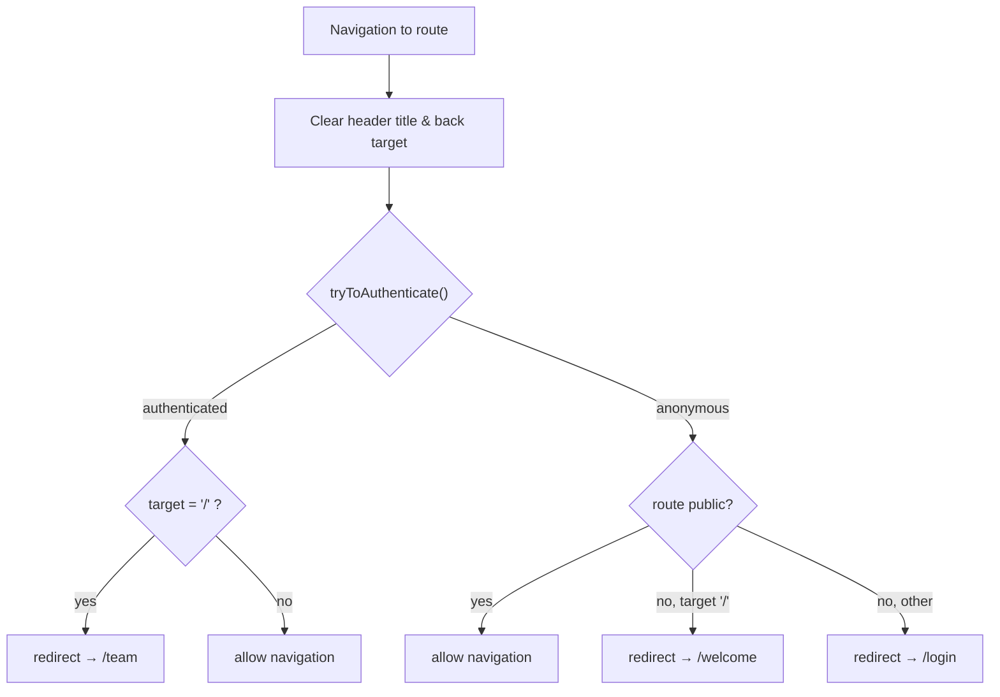
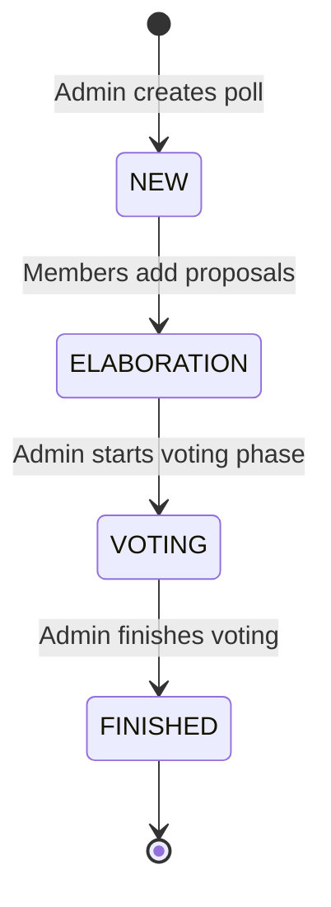
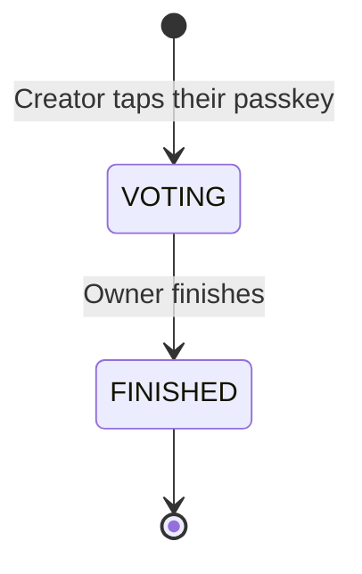

# LIQUIDO Mobile PWA — Technical Architecture

> Technical overview of the LIQUIDO mobile Progressive Web App (Vue 3).
> Audience: developers working on the codebase.

---

## 1. Tech Stack

| Concern | Technology | Version | Notes |
|---|---|---|---|
| UI framework | Vue | `^3.5.21` | Mixed Options API (legacy pages) and `<script setup>` Composition API (newer pages) |
| Build tool / dev server | Vite | `^8.0.10` | HTTPS dev server, env-based config alias |
| Router | vue-router | `^4.2.5` | `createWebHistory`, global auth navigation guard |
| i18n | vue-i18n | `^9.7.1` | Legacy mode with `allowComposition: true` |
| CSS framework | Bootstrap | `^5.3.8` | Imported via npm in `main.js`; overridden by `liquido.css` design tokens |
| Icons | Font Awesome | 6.5.2 (free) | Static files under `public/fontawesome-free-6.5.2-web/` |
| HTTP transport | axios | `^1.16.0` | Used by the GraphQL client |
| Client cache | populating-cache | `^5.7.0` | TTL caches for team and polls |
| WebAuthn | @simplewebauthn/browser | `^13.2.2` | Passkey / 2FA registration and login |
| Local DB | dexie | `^4.4.2` | IndexedDB wrapper (e.g. local user photo store) |
| Event bus | tiny-emitter | `^2.1.0` | Cross-component pub/sub |
| QR codes | qrcode | `^1.5.3` | Team invite links |
| Animation | gsap | `^3.12.2` | |
| Logging | loglevel | `^1.9.2` | Full logging enabled in dev/test |
| Date/time | dayjs | `^1.11.10` | |
| Unit tests | vitest | `^3.2.4` | + `@vue/test-utils`, jsdom |
| E2E tests | cypress | `^15.17.0` | |

---

## 2. High-Level Architecture



The app is a single-page PWA. All backend communication is funnelled through a single
gateway module, `liquido-graphql-client.js`, which owns authentication (JWT), transport,
and in-memory caching.

---

## 3. Application Bootstrap

Entry point: `src/main.js`

1. Imports the environment-specific `config` (see §4).
2. Logs a welcome banner and the active config source + API URL.
3. Enables full `loglevel` logging in `development` and `test` modes.
4. Imports global CSS **in order**: `bootstrap/dist/css/bootstrap.css` **then**
   `@/styles/liquido.css` — the LIQUIDO stylesheet must load *after* Bootstrap so its
   design-token overrides win.
5. Creates the Vue app from `root-app.vue`.
6. Installs plugins: `router`, `vue-i18n` (`createI18n`), and the reactive `store`.
7. Mounts the app.

### i18n configuration
- `createI18n` is set up with `locale: "de"`, `fallbackLocale: "de"`,
  `allowComposition: true`, `silentFallbackWarn: true`, `warnHtmlInMessage: 'off'`.
- Global translations live in `globalTranslations` inside `main.js`.
- **Local component messages** must be added to `globalTranslations` (or an `<i18n>`
  SFC custom block). `useI18n({ useScope: "local" })` alone throws in legacy mode
  because no custom-block plugin is configured.

---

## 4. Configuration System

- Components import a bare specifier: `import config from "config"`.
- `vite.config.js` maps `config` to `config/config.<NODE_ENV>.js` at build time.
- Shared defaults live in `config/config.common.js`.
- Exposes values such as `LIQUIDO_API_URL`, `BASE_URL`, `mockBackend`, `avatarPath`,
  `inviteLinkPrefix`, and `configSource`.
- `config.mockBackend` toggles the mocked GraphQL client and turns the header red as a
  visual warning.

---

## 5. Routing & Authentication Guard

Router: `src/services/router.js` using `createWebHistory(config.BASE_URL)`.
`scrollBehavior` is disabled (returns `false`); scroll position is managed in
`root-app.vue` instead to avoid `history.state` warnings.

### Routes

| Path | Name | Public | Component |
|---|---|---|---|
| `/` | index | — | (redirect logic only) |
| `/login` | login | ✅ | login-page.vue |
| `/welcome` | welcome | ✅ | welcome-chat.vue |
| `/team` | team | 🔒 | team-home.vue |
| `/userhome` | userhome | 🔒 | user-home.vue |
| `/polls` | polls | 🔒 | polls.vue |
| `/polls/create` | createPoll | 🔒 | poll-create.vue |
| `/polls/:pollId` | showPoll | 🔒 | poll-show.vue |
| `/polls/:pollId/add` | addProposal | 🔒 | proposal-add.vue |
| `/polls/:pollId/castVote` | castVote | 🔒 | cast-vote.vue |
| `/polls/:pollId/winner` | pollWinner | 🔒 | poll-winner.vue |
| `/polly` | createPolly | ✅ | polly-page.vue |
| `/polly/:publicId` | showPolly | ✅ | polly-page.vue |
| `/forgotPassword` | forgotPassword | ✅ | forgot-password.vue |
| `/resetPassword` | resetPassword | ✅ | forgot-password.vue |
| `/login-via-sms` | loginSms | ✅ | login-via-sms.vue |
| `/404` | pageNotFound | ✅ | not-found-page.vue |
| `/:pathMatch(.*)*` | — | — | redirect → `/404` |

Dev-only routes (added when `MODE === "development"`): `/devLogin`, `/_design-overview`.

### Navigation guard (`router.beforeEach`)



`tryToAuthenticate()`:
1. If `api.isAuthenticated()` (JWT + team + user in cache) → resolve immediately
   (saves a backend call, even if the JWT may be expired).
2. Else read JWT from `localStorage` and call `api.loginWithJwt(jwt)`.
3. On `JWT_TOKEN_EXPIRED` / `JWT_TOKEN_INVALID`, remove the JWT from `localStorage`.

---

## 6. API Layer — `liquido-graphql-client.js`

Central gateway; the **only** module that talks to the backend. A mock twin,
`liquido-graphql-client.mock.js`, is swapped in when `config.mockBackend` is set.

### Responsibilities
- GraphQL transport over axios.
- JWT authentication: attaching the token, storing it in `localStorage`
  (`LIQUIDO_JWT_KEY`) and in the in-memory `teamCache`.
- In-memory caching via `populating-cache`.

### Caches

| Cache | Holds | Notes |
|---|---|---|
| `teamCache` | `team`, `currentUser`, `jwt` | Populated on login (`loginWithJwt` / auth success) |
| `pollsCache` | `polls` array | Seeded with `[]` until polls load after login |

### Key synchronous accessors (safe to call in `computed` after auth guard runs)
- `api.getCachedUser()` → current user object
- `api.getCachedTeam()` → current team object
- `api.getCachedPolls()` → array of polls
- `api.isAdmin()` → boolean (admin status is session-stable)
- `api.isAuthenticated()` → JWT + team + user all present

### Auth lifecycle
- `loginWithJwt(jwt)` — authenticates, fills `teamCache`, persists JWT.
- `logout()` — clears JWT from `localStorage`, empties `teamCache` and `pollsCache`.

---

## 7. Authentication Methods

- **JWT auto-login** — silent re-auth from `localStorage` on every navigation.
- **Email + password** — `login-page.vue`.
- **Email magic link / token** — `email` + `emailToken` query params on `/login`.
- **SMS** — `login-via-sms.vue`.
- **WebAuthn / Passkey** — `webauthn-service.js` (`@simplewebauthn/browser`) for
  passwordless login and 2FA registration.
- **Forgot / reset password** — `forgot-password.vue` (shared by `/forgotPassword`
  and `/resetPassword`).
- **Dev login** — `/devLogin` (development mode only) for automated testing.

---

## 8. Poll Lifecycle



| Status | German label | Meaning |
|---|---|---|
| `NEW` / `ELABORATION` | "Neue Abstimmung" / "Diskussion" | Proposals are being collected |
| `VOTING` | "Wahl läuft" | Ballots are being cast |
| `FINISHED` | "Abgeschlossen" | Result available |

### Voting flow
1. Member opens a poll in `VOTING` state (`poll-show.vue`).
2. Navigates to `cast-vote.vue` (`/polls/:pollId/castVote`).
3. Orders proposals into a preference ballot and submits.
4. Admin later finishes the voting phase; results become visible.

---

## 8b. Polly — the small sibling

A **Polly** is a quick poll with no team, no account and no login screen. It is a
**separate module** (`src/polly/`) that shares the app shell and nothing else — its own
client, its own session key, its own mock. See `doc/use-case-flows/polly.mermaid`.



Only two states: a polly is live from the moment it exists. No elaboration phase, no
start step.

| Concern | Polly | LIQUIDO poll |
|---|---|---|
| Identity | A passkey (WebAuthn discoverable credential) | Team membership + JWT |
| Session key | `LIQUIDO_POLLY_JWT` | `LIQUIDO_JWT` |
| One vote per voter | `UNIQUE(polly_id, voter_key)` where `voter_key = HMAC(secret, credentialId ‖ pollyId)` | one-time `voterToken` |
| Ballot privacy | **Pseudonymous** — the server can link a passkey to its ballot | **Anonymous** — the ballot carries only a checksum |
| Links | One public link, opaque `publicId`; no admin link | Team-scoped routes |
| Shared with polls | The Ranked Pairs winner calculation, and nothing else | — |

The privacy difference is deliberate and must stay visible in the UI: a polly is
*private among friends*; a LIQUIDO poll is *anonymous*.

**Module boundary:** nothing under `src/polly/` imports `liquido-graphql-client.js`, and
nothing outside it imports the polly client. An earlier version shared the poll table and
the `pollsCache`, and a polly leaked into the team's poll list. `tests/unit/polly-flow.spec.js`
asserts the two import graphs stay disjoint.

---

## 9. Cross-Cutting Concerns

### State — `store.js`
Lightweight reactive store for UI state (e.g. `headerTitle`, `headerBackTarget`).
Cleared by the router guard on every route change so each page can set its own.

### Event bus — `event-bus.js`
`tiny-emitter` pub/sub. Known events: `LOGIN`, `LOGOUT`, `POLLS_LOADED`, `POLL_LOADED`,
`MOBILE_DEBUG_LOG`, `CLICK_HEADER_CENTER`.

### Design system — `styles/liquido.css`
CSS custom properties drive the whole visual language: `--primary`, `--secondary`,
`--text-color`, `--app-background`, `--liquido-info-*`, `--state-*`, spacing units
(`--unit`, `--two`, …). Bootstrap components are re-skinned by aliasing `--bs-*`
variables (e.g. `.btn-primary` uses `--bs-btn-bg: var(--primary)`).

### Mobile debug log
`mobile-debug-service.js` + `mobile-debug-log.vue` provide an on-device log overlay
(useful on phones without dev tools), fed via the `MOBILE_DEBUG_LOG` event.

---

## 10. Project Structure

```
src/
  main.js                     App bootstrap, i18n, global CSS
  root-app.vue                Shell: router-view + footer, scroll handling
  components/                 Reusable UI (header, footer, input, poll-card, modals…)
  services/
    liquido-graphql-client.js API gateway + caches (+ .mock.js twin)
    router.js                 Routes + auth navigation guard
    store.js                  Reactive UI state
    event-bus.js              tiny-emitter pub/sub
    webauthn-service.js       Passkey / 2FA
    local-user-photo-db.js    Dexie / IndexedDB
    login-rest-client.js      REST auth calls
  views/                      Pages (one per route)
  polly/                      Self-contained Polly module (see §8b)
    polly-client.js           Own GraphQL client + axios instance (+ .mock.js twin)
    polly-session.js          Own session key (LIQUIDO_POLLY_JWT)
    polly-passkey.js          WebAuthn discoverable credential
    polly-i18n.js             Own translations + usePollyI18n()
    polly-constants.js        Status + error codes
  styles/liquido.css          Design tokens + Bootstrap overrides
config/                       Env-specific config (mapped to bare "config" import)
public/                       Static assets (Font Awesome, icons, manifest)
tests/                        unit (vitest) + e2e (cypress)
```

---

## 11. Build & Deploy

- **Dev**: `npm start` (or `npm run dev`) → Vite dev server over HTTPS using the
  mkcert certificates in `tls-certs/`.
- **Build**: `npm run build` → static bundle via Vite.
- **Preview**: `npm run preview`.
- **Container**: `Dockerfile` builds the image; `fly.toml` configures Fly.io deploy;
  `deploy/build-and-deploy.sh` orchestrates the pipeline.

---

## 12. Security Notes

- JWTs are stored in `localStorage` and re-validated against the backend on load;
  expired/invalid tokens are proactively purged.
- WebAuthn provides passwordless / phishing-resistant authentication.
- The mocked backend is clearly signalled in the UI (red header) to avoid confusing
  test data with production.
- All backend access is centralised in one module, keeping the auth surface small.
