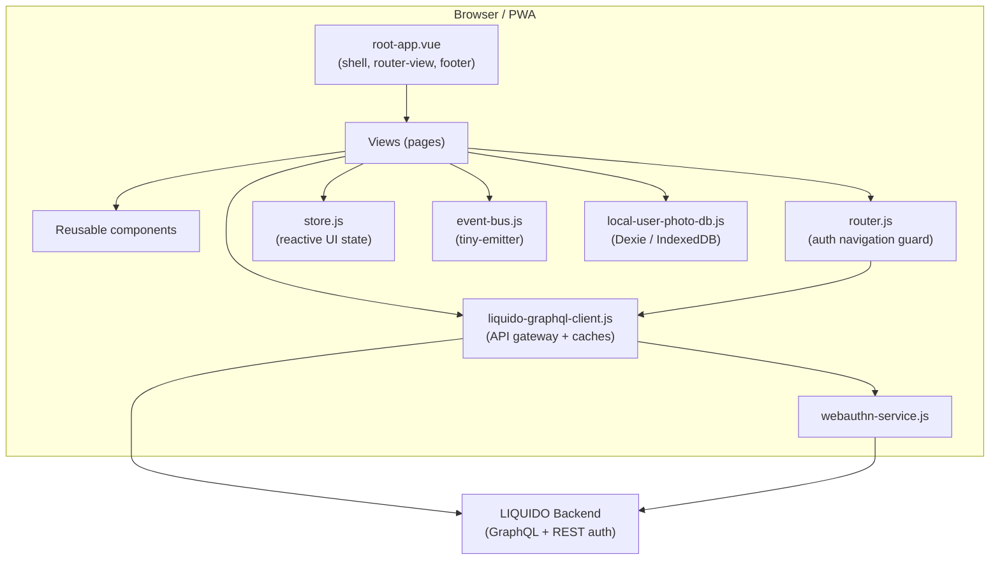
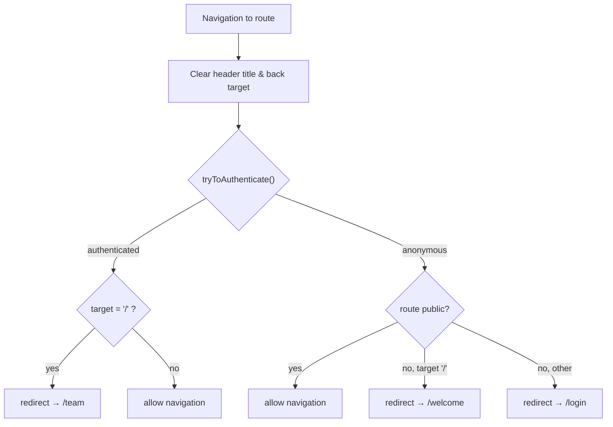
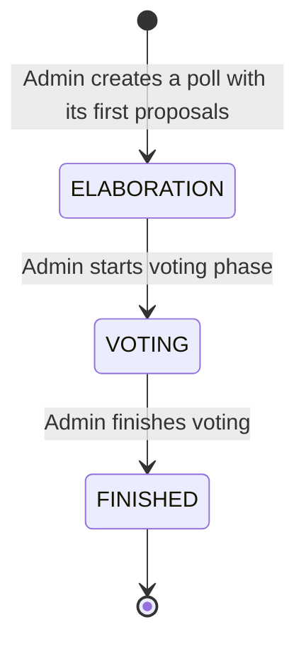
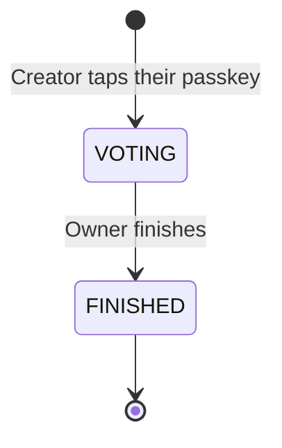

# LIQUIDO Mobile PWA — Technical Architecture

> Technical overview of the LIQUIDO mobile Progressive Web App (Vue 3).
> Audience: developers working on the codebase. Companion documents: [README-tech.md](README-tech.md)
> (setup, build, deploy), [liquido-testing.md](liquido-testing.md) (all testing and the environments
> DEV / TEST / MOCK / INT), [use cases](use-case-flows/liquido-use-cases.md) (what the app does for its
> users), [AGENTS.md](../AGENTS.md) (rules for AI agents) and the backend's
> [architecture](../../liquido-backend-quarkus/docs/liquido-architecture.md).

---

## 1. Tech Stack

| Concern | Technology | Version | Notes |
|---|---|---|---|
| UI framework | Vue | `^3.5.21` | Mixed Options API (legacy pages) and `<script setup>` Composition API (newer pages) |
| Build tool / dev server | Vite | `^8.0.10` | HTTPS dev server, env-based config alias |
| Router | vue-router | `^4.2.5` | `createWebHistory`, global auth navigation guard |
| i18n | liqui-loc | own | `src/services/liqui-loc.js` — replaced vue-i18n |
| CSS framework | Bootstrap | `^5.3.8` | Imported via npm in `main.js`; overridden by `liquido.css` design tokens |
| Icons | Font Awesome | 6.5.2 (free) | Static files under `public/fontawesome-free-6.5.2-web/` |
| HTTP transport | axios | `^1.16.0` | Used by the GraphQL client |
| Client cache | populating-cache | `^5.7.0` | TTL caches for team and polls |
| WebAuthn | @simplewebauthn/browser | `^13.2.2` | Passkey / 2FA registration and login |
| Local DB | dexie | `^4.4.2` | IndexedDB wrapper (e.g. local user photo store) |
| Event bus | tiny-emitter | `^2.1.0` | Cross-component pub/sub |
| Drag & drop | vuedraggable | `^4.1.0` | Sorting proposals into a ballot (`liquido-ballot.vue`, `polly-vote.vue`) |
| QR codes | qrcode | `^1.5.3` | Team invite links |
| Animation | gsap | `^3.12.2` | |
| Logging | loglevel | `^1.9.2` | Full logging enabled in dev/test |
| Date/time | dayjs | `^1.11.10` | |
| Unit tests | vitest | `^3.2.4` | + `@vue/test-utils`, jsdom |
| E2E tests | cypress | `^15.20.0` | |

---

## 2. High-Level Architecture



The app is a single-page PWA. All backend communication is funnelled through a single
gateway module, `liquido-graphql-client.js`, which owns authentication (JWT), transport,
and in-memory caching. (Polly has its own client, see §8b.)

**System context.** The backend is a Quarkus service with a GraphQL API at `/graphql` plus REST
endpoints for login and WebAuthn (`/login/*`, `/webauthn/*`, `/polly/webauthn/*`). In development the
PWA talks to it directly at `https://shadow.fritz.box:8443`; on GISMO (INT) Caddy serves the PWA's static
files and forwards `https://liquido.dynv6.net/api/v2/*` to the backend container. Which frontend talks to
which backend in each environment: [liquido-testing.md §2](liquido-testing.md#2-environments-dev-test-mock-int).

---

## 3. Application Bootstrap

Entry point: `src/main.js`

1. Imports the environment-specific `config` (see §4).
2. Logs a welcome banner and the active config source + API URL.
3. Enables full `loglevel` logging in `development` and `test` modes.
4. Imports global CSS **in order**: `bootstrap/dist/css/bootstrap.css` **then**
   `@/styles/liquido.css` — the LIQUIDO stylesheet must load *after* Bootstrap so its
   design-token overrides win.
5. Creates the Vue app from `root-app.vue`.
6. Installs plugins: `router`, liqui-loc (`createLoc`), and the reactive `store`; registers the
   global `<liqui-loc-html>` component.
7. Installs the global error boundary (`app.config.errorHandler`, `unhandledrejection`), which shows a
   localised message instead of raw backend errors.
8. Mounts the app.

### i18n — liqui-loc
- Our own small library, `src/services/liqui-loc.js`; it replaced vue-i18n, whose legacy mode could not
  give `<script setup>` components access to their own messages.
- Global translations live in `globalTranslations` inside `main.js`; German is the only complete locale.
- Component-local messages go in the `i18n: { messages: { … } }` component option. `$t`, `$tc`, `$d`,
  `$fromNow` are global properties; `<script setup>` uses `useLoc()`.
- Messages containing HTML are rendered only through `<liqui-loc-html>`, which escapes parameters and
  sanitises. The usage rules for writing code are in [AGENTS.md §4](../AGENTS.md#4-house-style).

---

## 4. Configuration System

- Components import a bare specifier: `import config from "config"`.
- `vite.config.js` maps `config` to `config/config.<name>.js` at build time, where `<name>` is
  `LIQUIDO_CONFIG` if set, else `NODE_ENV` (`development` for `vite`, `test` for vitest).
  `npm run dev:mock` sets `LIQUIDO_CONFIG=mock`.
- Shared defaults live in `config/config.common.js`.
- Checked in, because they hold no credentials: `config.common.js`, `config.test.js` (vitest) and
  `config.mock.js` (the backend-free e2e run). Gitignored: `config.development.js` (copy it from
  `config.development.js.example`) and `config.production.js` (used by `npm run build`).
- Exposes values such as `LIQUIDO_API_URL`, `BASE_URL`, `mockBackend`, `mockPasskey`, `avatarPath`,
  `inviteLinkPrefix`, `pollyLinkPrefix` and `configSource`.
- `LIQUIDO_API_URL` is the backend's **API root** (e.g. `https://shadow.fritz.box:8443` or
  `https://liquido.dynv6.net/api/v2`); the clients append `/graphql`, `/login/…` and `/webauthn/…`
  themselves, so it never ends in `/graphql`.
- Validation limits in `config.common.js` are only fallbacks: at startup `root-app.vue` fetches
  `query liquidoConfig` from the backend and merges the real values over them.
- `config.mockBackend` makes the Vite dev server answer every backend call itself (see §6) and
  turns the LIQUIDO icon in the header red as a visual warning.

---

## 5. Routing & Authentication Guard

Router: `src/services/router.js` using `createWebHistory(config.BASE_URL)`.
`scrollBehavior` is disabled (returns `false`); scroll position is managed in
`root-app.vue` instead to avoid `history.state` warnings.

### Routes

The authoritative list is `src/services/router.js`. Order matters: `/polls/new` is declared **before**
`/polls/:pollId`, or the param route swallows it.

| Path | Name | Public | Component / notes |
|---|---|---|---|
| `/` | index | | redirect only: to `/team` when logged in, else `/welcome` |
| `/login` | login | ✅ | `login-page.vue`; `?email=&emailToken=` logs in from an email link |
| `/welcome` | welcome | ✅ | `welcome-chat-v2.vue`: registration — creating a team, or joining one via `?inviteCode=` |
| `/forgotPassword`, `/resetPassword` | forgotPassword, resetPassword | ✅ | both `forgot-password.vue`; `/resetPassword` takes `?resetPasswordToken=` |
| `/verifyEmail` | verifyEmail | ✅ | `verify-email.vue`, opened from a mail with `?verifyToken=` |
| `/login-via-sms` | loginSms | ✅ | `login-via-sms.vue` — unused: nothing links to it, and the backend's SMS mutations are commented out |
| `/team` | team | 🔒 | `team-home.vue` |
| `/userhome` | userhome | 🔒 | `user-home.vue` |
| `/polls` | polls | 🔒 | `polls.vue`, the list |
| `/polls/new` | newPoll | 🔒 | `poll-edit.vue`: the all-in-one poll editor |
| `/polls/:pollId` | showPoll | 🔒 | `poll-show.vue`, read-only |
| `/polls/:pollId/edit` | editPoll | 🔒 | `poll-edit.vue`, existing poll |
| `/polls/:pollId/add` | addProposal | 🔒 | `proposal-add.vue`: old two-step flow, deprecated but deliberately kept reachable |
| `/polls/:pollId/castVote` | castVote | 🔒 | `cast-vote.vue`: rank and submit a ballot |
| `/polls/:pollId/winner` | pollWinner | 🔒 | `poll-winner.vue`: winner, pairwise breakdown, duel matrix, Ranked Pairs graph |
| `/polly` | createPolly | ✅ | `polly-page.vue`: create a Polly (§8b) |
| `/polly/:publicId` | showPolly | ✅ | `polly-page.vue`: the one link a Polly creator shares |
| `/impressum`, `/agb`, `/datenschutz` | impressum, agb, datenschutz | ✅ | German legal pages, linked from the bottom of `team-home.vue` |
| `/404`, any unknown path | pageNotFound | ✅ | `not-found-page.vue` |

Dev-only routes (added when `MODE === "development"`): `/devLogin` and `/_design-overview` (a gallery of
every screen). Retired on purpose: `/polls/create` (`poll-create.vue`, replaced by `/polls/new`) and
`/joinTeam` (`join-team-v2.vue`, replaced by `/welcome?inviteCode=`; the old page checked while typing
whether an email was already registered, the new flow finds out on submit and links to `/login`). Both
files are still in the repo, unused. Rules for adding routes: [AGENTS.md §6](../AGENTS.md#6-routes--the-rules).

### Navigation guard (`router.beforeEach`)



`tryToAuthenticate()`:
1. If `api.isAuthenticated()` (JWT + team + user in cache) → resolve immediately
   (saves a backend call, even if the JWT may be expired).
2. Else read JWT from `localStorage` and call `api.loginWithJwt(jwt)`.
3. On `JWT_TOKEN_EXPIRED` / `JWT_TOKEN_INVALID`, remove the JWT from `localStorage`.

---

## 6. API Layer — `liquido-graphql-client.js`

Central gateway; the **only** module that talks to the backend.

When `config.mockBackend` is set, this module stays exactly the same except for one thing: it sends
its requests to the dev server's own origin instead of `LIQUIDO_API_URL`. There
`vite-plugin-mock-backend.js` answers them from `mock-backend/` — GraphQL, the `/login/*` REST calls
and the `/webauthn/*` ceremony — as real HTTP, so Cypress sees mocked traffic exactly like real
traffic and the e2e specs run unmodified against either. The mock's "database" lives in the dev
server process. vitest has no dev server, so under `config.test.js` the client calls
`mock-backend/liquido-mock-domain.js` in-process instead. Details: [liquido-testing.md §6.6](liquido-testing.md#66-the-mock-backend).

### Responsibilities
- GraphQL transport over axios.
- JWT authentication: attaching the token, storing it in `localStorage`
  (`LIQUIDO_JWT_KEY`) and in the in-memory `teamCache`.
- In-memory caching via `populating-cache`.

### Caches

| Cache | Holds | Notes |
|---|---|---|
| `teamCache` | `team`, `currentUser`, `jwt` | Populated on login (`loginWithJwt` / auth success) |
| `pollsCache` | `polls` array | Seeded with `[]` until polls load after login |

### Key synchronous accessors (safe to call in `computed` after auth guard runs)
- `api.getCachedUser()` → current user object
- `api.getCachedTeam()` → current team object
- `api.getCachedPolls()` → array of polls
- `api.isAdmin()` → boolean (admin status is session-stable)
- `api.isAuthenticated()` → JWT + team + user all present

### Auth lifecycle
- `loginWithJwt(jwt)` — authenticates, fills `teamCache`, persists JWT.
- `logout()` — clears JWT from `localStorage`, empties `teamCache` and `pollsCache`.

---

## 7. Authentication Methods

- **JWT auto-login** — silent re-auth from `localStorage` on every navigation.
- **Email + password** — `login-page.vue`.
- **Email magic link / token** — `email` + `emailToken` query params on `/login`.
- **Email verification** — `/verifyEmail?verifyToken=…`, from the welcome mail.
- **SMS** — `login-via-sms.vue`; currently switched off (no link to it, backend SMS mutations commented out).
- **WebAuthn / Passkey** — `webauthn-service.js` (`@simplewebauthn/browser`) for
  passwordless login and 2FA registration.
- **Forgot / reset password** — `forgot-password.vue` (shared by `/forgotPassword`
  and `/resetPassword`).
- **Dev login** — `/devLogin` (development mode only) for automated testing.

---

## 8. Poll Lifecycle



There are exactly three statuses; a poll starts in `ELABORATION` (there is no `NEW`).

| Status | Meaning |
|---|---|
| `ELABORATION` | Proposals are being collected, edited, liked |
| `VOTING` | Proposals are frozen, ballots are being cast |
| `FINISHED` | The winner is calculated and shown |

Who may do what in each phase is a business rule — see the [use cases](use-case-flows/liquido-use-cases.md).

### Voting flow
1. Member opens a poll in `VOTING` state. A running poll the member has not voted in yet opens the
   ballot directly — from the poll list and from `team-home.vue` (`/polls/:pollId/castVote`).
2. In `cast-vote.vue` the member drags proposals into a preference ballot and submits it; the client
   first fetches a one-time `voterToken`, then calls `castVote` with it.
3. The member gets a checksum back and can verify their ballot.
4. The admin finishes the voting phase (also possible straight from the ballot page); the winner page
   shows the result.

---

## 8b. Polly — the small sibling

A **Polly** is a quick poll with no team, no account and no login screen. It is a
**separate module** (`src/polly/`) that shares the app shell and nothing else — its own
client, its own session key, its own mock. See `docs/use-case-flows/polly.mermaid`.



Only two states: a polly is live from the moment it exists. No elaboration phase, no
start step.

| Concern | Polly | LIQUIDO poll |
|---|---|---|
| Identity | A passkey (WebAuthn discoverable credential) | Team membership + JWT |
| Session key | `LIQUIDO_POLLY_JWT` | `LIQUIDO_JWT` |
| One vote per voter | `UNIQUE(polly_id, voter_key)` where `voter_key = HMAC(secret, credentialId ‖ pollyId)` | one-time `voterToken` |
| Ballot privacy | **Pseudonymous** — the server can link a passkey to its ballot | **Anonymous** — the ballot carries only a checksum |
| Links | One public link, opaque `publicId`; no admin link | Team-scoped routes |
| Shared with polls | The Ranked Pairs winner calculation, and nothing else | — |

The privacy difference is deliberate and must stay visible in the UI: a polly is
*private among friends*; a LIQUIDO poll is *anonymous*.

**Module boundary:** nothing under `src/polly/` imports `liquido-graphql-client.js`, and
nothing outside it imports the polly client. An earlier version shared the poll table and
the `pollsCache`, and a polly leaked into the team's poll list. `tests/unit/polly-flow.spec.js`
asserts the two import graphs stay disjoint.

---

## 9. Cross-Cutting Concerns

### State — `store.js`
Lightweight reactive store for UI state (e.g. `headerTitle`, `headerBackTarget`).
Cleared by the router guard on every route change so each page can set its own.

### Event bus — `event-bus.js`
`tiny-emitter` pub/sub. Known events: `LOGIN`, `LOGOUT`, `POLLS_LOADED`, `POLL_LOADED`,
`MOBILE_DEBUG_LOG`, `CLICK_HEADER_CENTER`.

### Design system — `styles/liquido.css`
CSS custom properties drive the whole visual language: `--primary`, `--secondary`,
`--text-color`, `--app-background`, `--liquido-info-*`, `--state-*`, spacing units
(`--unit`, `--two`, …). Bootstrap components are re-skinned by aliasing `--bs-*`
variables (e.g. `.btn-primary` uses `--bs-btn-bg: var(--primary)`).

### Mobile debug log
`mobile-debug-service.js` + `mobile-debug-log.vue` provide an on-device log overlay
(useful on phones without dev tools), fed via the `MOBILE_DEBUG_LOG` event.

---

## 10. Project Structure

```
src/
  main.js                     App bootstrap, i18n, global CSS
  root-app.vue                Shell: router-view + footer, scroll handling
  components/                 Reusable UI (header, footer, input, poll-card, modals…)
  services/
    liquido-graphql-client.js API gateway + caches
    router.js                 Routes + auth navigation guard
    store.js                  Reactive UI state
    event-bus.js              tiny-emitter pub/sub
    webauthn-service.js       Passkey / 2FA
    local-user-photo-db.js    Dexie / IndexedDB
    login-rest-client.js      REST auth calls
    liqui-loc.js              Our own i18n library
    jwt-util.js               Decodes the cached JWT (admin role per team)
  views/                      Pages (one per route)
  polly/                      Self-contained Polly module (see §8b)
    polly-client.js           Own GraphQL client + axios instance (+ .mock.js twin)
    polly-session.js          Own session key (LIQUIDO_POLLY_JWT)
    polly-passkey.js          WebAuthn discoverable credential
    polly-i18n.js             Own translations + usePollyI18n()
    polly-constants.js        Status + error codes
  styles/liquido.css          Design tokens + Bootstrap overrides
  mockdata/                   Seed data of the mock backend (teamUserJwt.json)
config/                       Env-specific config (mapped to bare "config" import)
mock-backend/                 Mock backend, served over HTTP by the dev server (see §6)
  liquido-mock-domain.js      State + GraphQL handlers (also used in-process by vitest)
  liquido-mock-http-server.js Routes: /graphql, /login/*, /webauthn/*, /mock/reset
vite-plugin-mock-backend.js   Mounts mock-backend/ as dev-middleware when config.mockBackend
public/                       Static assets (Font Awesome, icons, manifest)
tests/                        unit (vitest) + e2e (cypress)
```

---

## 11. Build & Deploy

- **Dev**: `npm run dev` (alias `npm start`) → Vite dev server over HTTPS on port 3001, using the mkcert
  certificates in `tls-certs/`. `npm run dev:mock` → the same with the mock backend on port 3002.
- **Build**: `npm run build` → static bundle in `dist/`, built with `config/config.production.js`.
- **Deploy**: on GISMO, Caddy serves `dist/` as static files from `/var/www/liquido-frontend` (with an
  SPA fallback to `index.html`); `deploy/build-and-deploy-local.sh` builds and copies it there
  (`deploy/build-and-deploy.sh` does the same from the laptop via rsync). Deploying is always a human
  decision. Details: [README-tech.md](README-tech.md#build-and-deploy).
- `Dockerfile` and `fly.toml` are left over from a Fly.io trial and are not used.

## 12. Security Notes

- JWTs are stored in `localStorage` and re-validated against the backend on load;
  expired/invalid tokens are proactively purged.
- WebAuthn provides passwordless / phishing-resistant authentication.
- The mocked backend is clearly signalled in the UI (red LIQUIDO icon) to avoid confusing
  test data with production. It only exists in the dev server: a production build has no
  middleware to answer it.
- All backend access is centralised in one module, keeping the auth surface small.
